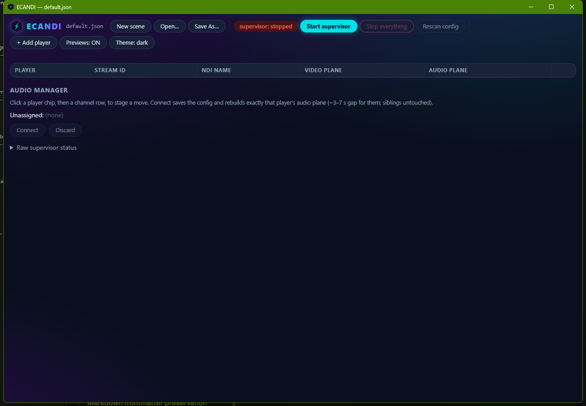
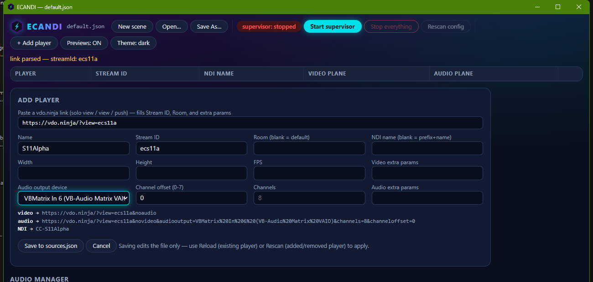
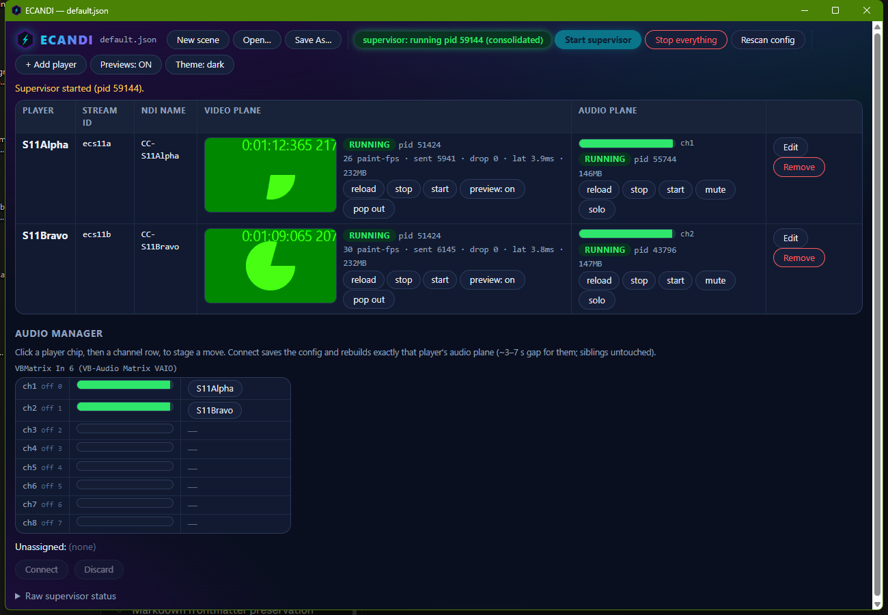

# ECANDI — Quick Start

Your first fifteen minutes. By the end of it, one remote guest's camera will be
an NDI source in OBS and their microphone will be on its own mixer channel.

ECANDI is for the person running a multi-guest live show: each guest joins
through a vdo.ninja link, and ECANDI turns each of them into **two independent
things** — a named NDI video stream for OBS, and one dedicated audio channel on
a virtual audio cable. The two never touch each other, so fixing one guest's
audio never disturbs anyone's video.

---

## Before you start

You need three things besides ECANDI:

| Thing | Why | Notes |
|---|---|---|
| **A vdo.ninja link per guest** | This is how their camera and mic reach your machine | A "solo view" link from your director's room, or any `?view=…` / `?push=…` link |
| **A multi-channel virtual audio device** | Where each guest's audio lands, one guest per channel | VB-Audio Matrix (or VoiceMeeter) with an 8-channel VAIO is the tested setup |
| **OBS with the DistroAV (NDI) plugin** | Consumes the video streams | On this machine or any machine on the same network |

If you only want to see ECANDI work, you can skip the audio device — video alone
is a complete demonstration.

---

## 1. Install

Run **`ECANDI-setup-1.0.0.exe`**.

- Windows SmartScreen will warn you that the publisher is unknown. ECANDI v1 is
  not code-signed. Choose **More info → Run anyway**.
- The installer asks nothing except where to put it. It installs **just for
  you** — no administrator prompt, no elevation.
- Default location: `C:\Users\<you>\AppData\Local\Programs\ECANDI`

You get **ECANDI** in the Start menu and on the desktop. Nothing else needs
installing — the custom Electron runtime, the NDI runtime, the native sender
module, and the PowerShell helpers all ship inside the app.

> **Portable option:** `ECANDI-portable-1.0.0.exe` runs without installing.
> Same app; it unpacks to a temporary folder on each launch.

---

## 2. First launch

Open **ECANDI**. You land in the console on an empty scene:

A few things to know about this window:

- **It is the only window you need.** Everything else ECANDI runs — the
  supervisor, the video host, one audio worker per guest — is a background
  process it manages for you.
- **The scene** (`default.json`, named in the title bar) is your guest list. It
  lives in `Documents\ECANDI\`, not inside the installed app, so it survives
  upgrades and uninstalls.
- **Nothing is running yet.** The red `supervisor: stopped` pill tells you so.

---

## 3. Add your first guest

Click **+ Add player**.

Copy the guest's vdo.ninja link and paste it into the top field — the one
labelled *Paste a vdo.ninja link*. ECANDI reads the link and fills in the
Stream ID for you, keeping any parameters that matter (like `&solo`) and
dropping the ones it manages itself.

Then set three things:

1. **Name** — how this guest appears everywhere: in the console, in the NDI
   stream name, on your OBS source. Use something short and real: `Alice`.
2. **Audio output device** — pick your virtual cable from the dropdown. It
   lists every playback device on the machine with its channel count, so the
   8-channel one is easy to spot.
3. **Channel offset** — which channel this guest's audio lands on, counting
   from **0**. Offset `0` is channel 1, offset `1` is channel 2, and so on.
   Give every guest their own.

Leave Width, Height, and FPS blank unless you have a reason — blank means
1920×1080 at 30 fps, which is what most shows want.

Watch the three lines under the form as you type. They show the exact URLs and
NDI name ECANDI will use. That's the whole configuration, visible before you
commit to it.

Click **Save to sources.json**. The guest appears as a row.

Repeat for each guest. Give each one a different channel offset.

> **In-room links need `&solo`.** If your guests are in a vdo.ninja *room* and
> you paste a plain room view link, ECANDI will connect to nothing. The solo
> link from the director panel is the one to copy — it already has `&solo` in
> it, and pasting keeps it.

---

## 4. Start everything

Click **Start supervisor**.

ECANDI brings the guests up one at a time — video first, then audio — waiting
for each to finish loading before starting the next. Give it fifteen seconds or
so per guest. Rushing this is what breaks other setups; ECANDI deliberately
doesn't.

When a guest is fully up you see, on their row:

- A live **video thumbnail**. This is not a local copy — it is ECANDI receiving
  its own NDI stream back, so what you see is exactly what OBS will get.
- Green **RUNNING** chips on both planes, with the process id and live stats
  (`30 paint-fps · sent 5941 · drop 0`).
- A moving **audio meter** with the channel number beside it.

The **Audio Manager** below the rows shows the same thing channel by channel:
each of your virtual cable's channels, its live level, and which guest is
assigned to it.

---

## 5. Point OBS at the streams

Each guest is now on the network as an NDI source named **`CC-<Name>`** — so
`Alice` is `CC-Alice`. It shows up in OBS as `<YOUR-PC> (CC-Alice)`.

In OBS: **Add Source → NDI Source**, pick the guest, and set the source's
bandwidth to **Highest**. Do that once per guest.

The names never change when ECANDI restarts a guest, so your OBS scenes keep
working through anything ECANDI does. That is the point of naming them.

> `CC-` is the default prefix and you can change it per scene, but you rarely
> should — your OBS scenes are bound to these names.

---

## 6. Route the audio

Your guests' audio is now on separate channels of one virtual device. From
there it is your audio setup's business, not ECANDI's: in VB-Audio Matrix (or
whatever you use), each channel goes wherever you send it — to Dante, to a
mixer, to a recorder.

The meters in ECANDI tell you the audio truly arrived at the device, which is
the only part ECANDI can promise.

---

## 7. The two controls you'll actually use live

**Mute** — silences one guest instantly. The row shows a red **MUTED** chip and
their meter dies; everyone else is untouched. It mutes the audio *page*, not
the routing, so unmuting is instant and nothing reconnects.

**Reload audio** — the fix for one guest's audio going wrong. It rebuilds only
that guest's audio, taking about 3–7 seconds. Their video does not flicker,
and no other guest is affected at all.

You will not need to restart everything to fix one person. That is the whole
design.

---

## Reading the row at a glance

| What you see | What it means | What to do |
|---|---|---|
| **RUNNING** (green) | Working normally | Nothing |
| **starting** (amber) | Coming up | Wait |
| **rebuilding** (amber) | Recovering by itself after a crash | Wait — it self-heals |
| **failed** (red) | Gave up after repeated failures | Check the guest is still connected, then **start** |
| **stopped** (grey) | You stopped it | **start** when you want it back |
| **MUTED** (red) | You muted this guest | **unmute** |
| **audio misrouted — reload audio** (red) | Their audio is playing to the wrong device | **reload** on the audio plane |
| **PGM** (red) / **PVW** (green) | OBS has this guest live / in preview | Nothing — it's information |
| Empty meter, RUNNING chips | Their mic is muted or silent | Ask them to check their mic |

---

## Shutting down

**Stop everything** stops all guests and the supervisor, and asks first.

Closing the ECANDI window does **not** stop your show — the guests keep
streaming and reopening ECANDI reconnects you to the running session. That is
deliberate: the console can crash without taking your broadcast with it.

---

## Where things live

| What | Where |
|---|---|
| Your scenes (guest lists) | `Documents\ECANDI\` |
| The running log | `Documents\ECANDI\supervisor.log` |
| Your settings (theme, window) | `%APPDATA%\ECANDI` |
| The app itself | `%LOCALAPPDATA%\Programs\ECANDI` |

Only the last one is removed when you uninstall.

---

Next: **[MANUAL.md](MANUAL.md)** — every control, every state, and what to do
when something looks wrong.
